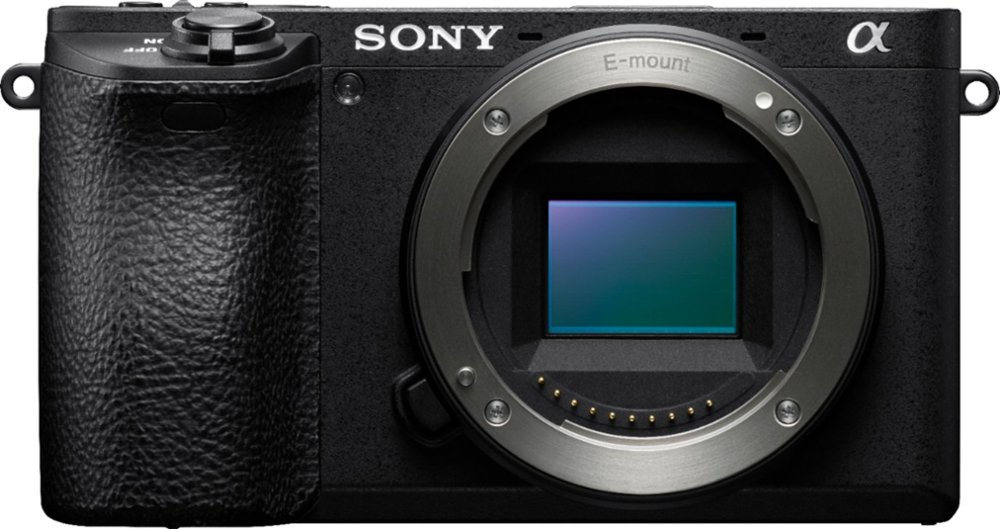

A friend of mine reached out recently asking about a potential camera body and lens for his partner for her birthday. He had a pretty good idea of what he wanted, but there was at least a thousand dollar difference between his options.

I talked to him a bit about what she would be using the camera for. He said it would be mostly to take photographs in JPEG and send them via WiFi to her iPhone where she could then upload them to social networks. We winded up narrowing it down to the Sony mirrorless compact Alpha series.

We then started talking about differences we weren't sure the difference mattered. The [a6400](https://www.sony.com/electronics/interchangeable-lens-cameras/ilce-6400) is brand new and [a6500](https://www.sony.com/electronics/interchangeable-lens-cameras/ilce-6500-body-kit), is more premium than the a6400, but is almost 3 years older. Looking further into the specifications we can see the a6400 has much higher contrast detection areas, but the a6500 has in body image stabilization. Since this was a new world both my friend and his partner were getting into instantly I knew what needed to happen.

I listen to a lot of podcasts. In many of the tech podcasts there was a common theme for some of the camera savvy individuals that did not want to shell out the multiple thousands of dollars required for certain lenses or bodies. They talked at length about a service that they repeatedly had success renting those expensive lenses from for a period of time.

That is when I told my friend to [look into Lensrentals](https://www.lensrentals.com/). The service would allow him to rent both camera bodies and a single lens for a week to try out. This would give them the advantage of practically using each camera body, with the lens they wanted for a week and compare the results. Having them in hand would afford them the knowledge of if the thousand dollars more a6500 was worth it. My friend agreed, this was a wonderful solution. I, too, plan on renting a few expensive Sony G Master lenses for upcoming trips from Lensrentals so I know if they are worth their cost before spending my hard earned money.

It gets better. As I read through the website I saw another [amazing service called Keeper](https://www.lensrentals.com/keeper). Say my friend and his partner have rented two Sony Alpha series bodies and a lens and know which one they want at the end of the week. Well, I think Lensrentals says it best, "Just rent an eligible item, and then we’ll give you a starting purchase price based on the age of the copy we send you. We’ll even give you a credit for a portion of the rental fees.". Ladies and gentlemen this is a brilliant service. If I rent a two thousand dollar lens from Lensrentals and love it, I can have it! That seals the deal for me! No restocking fees from the big box stores if I don't like a body or lens I purchased and my rental fee is credit towards the purchase? Yeah, you get me Lensrentals.
