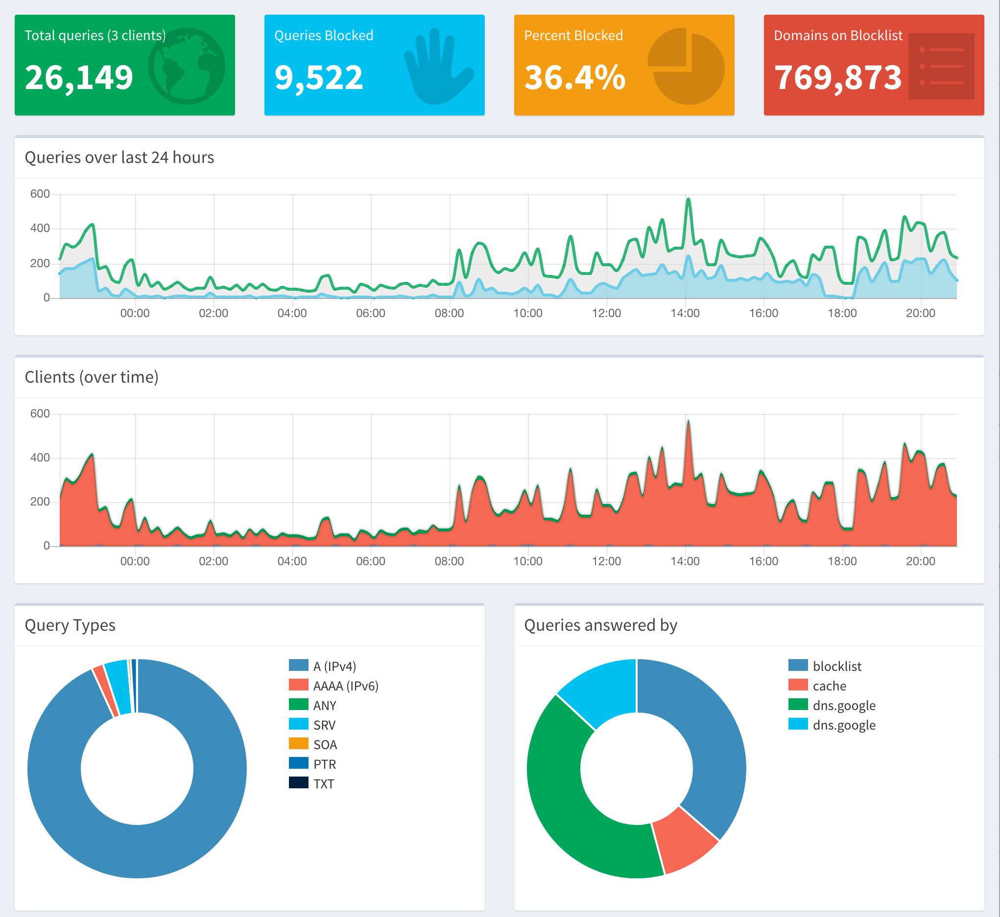

Article after article I read about how insidious online advertisers are. We are being tracked everywhere we go on the Internet, and off to a certain extent. I don't mind paying for services. I have been a YouTube Premium member for years. It brings me value. I pay for it. I have said I would pay for Facebook not to track every little thing I do. It's creepy, nobody likes it.

There are a slew of ad-blocking extensions for every browser out there. Some are good, some not. Watching an episode of Linus's Tech Tips the other day, "[Block EVERY Online Ad with THIS](https://www.youtube.com/watch?v=KBXTnrD_Zs4)" I became inspired. I had a couple retired Raspberry Pi 2's previously running [Rasplex](https://www.rasplex.com/) in the basement.

Within 25 minutes of [Linus's how-to article](https://linustechtips.com/main/topic/1094810-pi-hole-setup-tutorial/) I had [Pi-Hole](https://pi-hole.net/) up and running on my entire network. Pi-hole can do ad blocking for every device on your network. After I set it up I updated the [whitelists](https://github.com/anudeepND/whitelist) and [blacklists](https://v.firebog.net/hosts/lists.php).

I'll spare you rewriting an already good how-to article but I will say that it's been running on the entire network now for a week, flawlessly. The dashboard is great, I can see what has been blocked, quickly whitelist if needed, and tweak to my heart's desire. The Raspberry Pi now lives atop my switch. I couldn't be happier.

## Round Two

Recently [ISP's have been have been grumpy](https://arstechnica.com/tech-policy/2019/09/isps-worry-a-new-chrome-feature-will-stop-them-from-spying-on-you/) about Google's plans for encrypted DNS. This is via DNS-over-HTTPS, or DoH, which encrypts your DNS requests so that your ISP cannot track and sell that information. Quickly after setting this pi-hole up I ran into an article by Scott Helme, "[Securing DNS across all of my devices with Pi-Hole + DNS-over-HTTPS + 1.1.1.1](https://scotthelme.co.uk/securing-dns-across-all-of-my-devices-with-pihole-dns-over-https-1-1-1-1/)". In this article he details how to get [how to get cloudflared running](https://scotthelme.co.uk/securing-dns-across-all-of-my-devices-with-pihole-dns-over-https-1-1-1-1/#installingcloudflared) on the same Raspberry Pi. This is done through Cloudflare's [1.1.1.1 service](https://1.1.1.1/) using their [argo-tunnel](https://www.cloudflare.com/products/argo-tunnel/). Following Scott's instructions this was up and running in no time.

I would like to setup Let's Encrypt as he explains in the Bonus Round of the article. I think that would be a nice topping on the security cake. For now, I a happy knowing my ISP is no longer snooping on my DNS requests, they are probably also faster on Cloudflare's network, and I am blocking many many ads from all of my devices.
